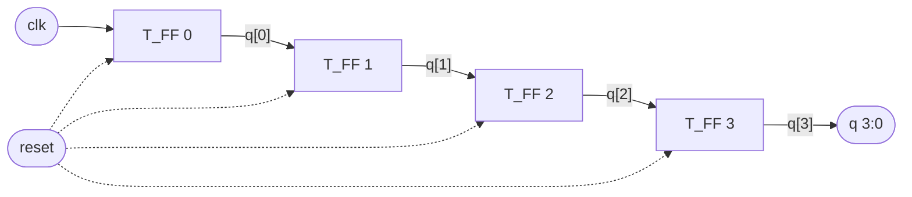
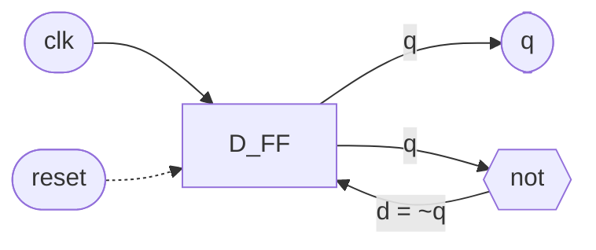

<div align="center">

🌐 **Live page: https://shoaibul0926.github.io/ripple-counter-4bit/**

# ⏱️ 4-Bit Ripple Carry Counter

**A counter built from four flip-flops, written in Verilog, simulated and viewed as a waveform.**


</div>

---

## 📖 What is this?

A **counter** is a circuit that counts clock pulses. This one is **4-bit**, so it holds a number from **0 to 15** (`0000` to `1111` in binary). After 15 it wraps back to 0 and keeps going.

It is called a **ripple** counter because the clock only goes to the first flip-flop. Each next flip-flop is clocked by the output of the one before it, so the change *ripples* from the first bit to the last, like a row of dominoes.

## 🧠 How it works

**1. A D flip-flop remembers one bit.** On the falling edge of its clock it copies its input `d` to its output `q`. If `reset` goes high, it clears `q` to 0 immediately (asynchronous reset).

**2. A T flip-flop toggles.** Connect the D flip-flop's input to its own inverted output (`d = ~q`) and every clock pulse flips the output: 0 → 1 → 0 → 1. This is a T (toggle) flip-flop, and its output is the clock divided by 2.

**3. Chain four of them.** `q[0]` is clocked by `clk`. `q[1]` is clocked by `q[0]`, `q[2]` by `q[1]`, and `q[3]` by `q[2]`. Each stage runs at half the speed of the one before, which is exactly how binary counting works.



### Inside one T flip-flop



### Why the bits count in binary

| Bit | Clocked by | Toggles every | Frequency (clk = 100 MHz) |
|:---:|:---:|:---:|:---:|
| `q[0]` | `clk` | 1 clock | 50 MHz |
| `q[1]` | `q[0]` | 2 clocks | 25 MHz |
| `q[2]` | `q[1]` | 4 clocks | 12.5 MHz |
| `q[3]` | `q[2]` | 8 clocks | 6.25 MHz |

Because every bit is half as fast as the one before, the four bits together read `0000, 0001, 0010, 0011 ... 1111`, then wrap to `0000`.

> ⚠️ **Ripple delay:** each flip-flop waits for the one before it, so the delays add up. That is why this counter is simple but slower than a synchronous counter, where every flip-flop shares the same clock.

## 🗂️ Design hierarchy

```
stimulus (testbench)
  |
  +-- ripple_carry_counter   (top block: q[3:0], clk, reset)
        |
        +-- T_FF x 4         (q[0] clocked by clk, q[n] clocked by q[n-1])
              |
              +-- D_FF + not gate   (D = ~Q, so the flip-flop toggles)
```

| File | Role | What it does |
|---|---|---|
| [`D_FF.v`](D_FF.v) | Building block | D flip-flop, falling-edge clock, async active-high reset |
| [`T_FF.v`](T_FF.v) | Building block | T flip-flop = `D_FF` + inverter feedback |
| [`ripple_carry_counter.v`](ripple_carry_counter.v) | Top design | Connects four `T_FF` in a ripple chain |
| [`stimulus.v`](stimulus.v) | Testbench | Generates clock and reset, prints and records `q` |
| [`run.bat`](run.bat) | Script | Compile, simulate and open the waveform in one click |
| [`view.tcl`](view.tcl) | Script | Tells GTKWave which signals to show |
| [`dump.vcd`](dump.vcd) | Output | Recorded signal changes, open with GTKWave |
| [`waveform.png`](waveform.png) | Output | Screenshot of the waveform below |

## 🌊 Waveform


**How to read it (top to bottom):**

| Signal | Meaning |
|---|---|
| `clk` | The clock, period 10 ns (toggles every 5 ns) |
| `reset` | High at the start, so the counter begins at 0. Goes low at 15 ns and counting starts. High again at 195 ns to show a reset in the middle of a count |
| `q[3:0]` | The whole counter as one number in hex (`0` to `F`) |
| `q[3]` `q[2]` `q[1]` `q[0]` | The four individual bits. `q[0]` is fastest, `q[3]` is slowest |

**What to notice:**
- The count goes `0, 1, 2 ... 9, A, B, C, D, E, F`, then wraps to `0` at 170 ns.
- Every bit changes on a **falling edge** of the signal that clocks it.
- At 195 ns reset goes high and `q` drops to 0 at once, without waiting for a clock edge. That is what *asynchronous* reset means.

## 🖥️ Simulation output

The testbench prints `q` every time it changes:

```
0 Output q = 0
20 Output q = 1
30 Output q = 2
...
160 Output q = 15
170 Output q = 0      <- wraps after 15
180 Output q = 1
190 Output q = 2
195 Output q = 0      <- reset asserted mid-count
210 Output q = 1
220 Output q = 2
```

The first count happens at 20 ns, not 10 ns, because `reset` is still high until 15 ns.

---

## 💻 The Code

### Design blocks

`ripple_carry_counter.v`
```verilog
`timescale 1ns/1ps
// Top block: 4-bit ripple carry counter
module ripple_carry_counter(q, clk, reset);
    output [3:0] q;
    input        clk, reset;

    // 4 instances of the T flip-flop; each is clocked by the previous stage's q
    T_FF tff0(q[0], clk,  reset);
    T_FF tff1(q[1], q[0], reset);
    T_FF tff2(q[2], q[1], reset);
    T_FF tff3(q[3], q[2], reset);
endmodule
```

`T_FF.v`
```verilog
`timescale 1ns/1ps
// T flip-flop built from a D flip-flop and an inverter
module T_FF(q, clk, reset);
    output q;
    input  clk, reset;
    wire   d;

    D_FF dff0(q, d, clk, reset);
    not  n1(d, q);          // not is a Verilog primitive; D = ~Q makes it toggle
endmodule
```

`D_FF.v`
```verilog
`timescale 1ns/1ps
// D flip-flop: negative-edge clock, asynchronous active-high reset
module D_FF(q, d, clk, reset);
    output q;
    input  d, clk, reset;
    reg    q;

    always @(posedge reset or negedge clk)
        if (reset)
            q = 1'b0;
        else
            q = d;
endmodule
```

### Stimulus block (testbench)

`stimulus.v`
```verilog
`timescale 1ns/1ps
// Stimulus block (testbench): drives clk and reset, prints q
module stimulus;
    reg        clk;
    reg        reset;
    wire [3:0] q;

    // instantiate the design block
    ripple_carry_counter r1(q, clk, reset);

    // clock: toggles every 5 ns (period 10 ns)
    initial clk = 1'b0;
    always #5 clk = ~clk;

    // control reset
    initial begin
        reset = 1'b1;       // reset the counter
        #15 reset = 1'b0;   // release reset, counting starts
        #180 reset = 1'b1;  // reset again mid-count
        #10 reset = 1'b0;
        #20 $finish;
    end

    // waveform dump (for GTKWave) and console monitor
    initial begin
        $dumpfile("dump.vcd");
        $dumpvars(0, stimulus);
    end
    initial $monitor($time, " Output q = %d", q);
endmodule
```

## ▶️ How to run

Needs [Icarus Verilog](https://bleyer.org/icarus/) (the Windows installer includes GTKWave).

**Windows:** double-click `run.bat`. It compiles, runs the simulation and opens GTKWave with `clk`, `reset`, `q[3:0]` and each bit already loaded (`view.tcl`).

**By hand:**
```
iverilog -o sim D_FF.v T_FF.v ripple_carry_counter.v stimulus.v
vvp sim
gtkwave dump.vcd --script view.tcl
```

| Step | Command | What happens |
|---|---|---|
| Compile | `iverilog -o sim ...` | Turns the Verilog files into a simulation program |
| Simulate | `vvp sim` | Runs it, prints `q`, writes `dump.vcd` |
| View | `gtkwave dump.vcd` | Opens the waveform |

## 🔤 Quick glossary

| Term | Meaning |
|---|---|
| Flip-flop | A circuit that stores one bit |
| Clock | A signal that pulses regularly and tells circuits when to update |
| Falling edge (`negedge`) | The moment the clock goes from 1 to 0 |
| Asynchronous reset | Clears the output right away, without waiting for a clock edge |
| Testbench | Code that drives the design's inputs so you can watch its outputs |
| Ripple | Each stage is clocked by the previous stage instead of a shared clock |
