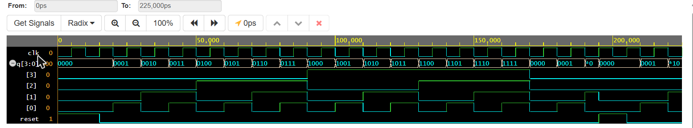

# 4-Bit Ripple Carry Counter (Verilog)

Basic hierarchical design after the ripple carry counter example in *Verilog HDL: A Guide to Digital Design and System Synthesis* by Samir Palnitkar.

**Run it online (EDA Playground, Icarus Verilog):** https://www.edaplayground.com/x/DR8z

## Block structure
```
stimulus (testbench)
  |
  +-- ripple_carry_counter   (top block: q[3:0], clk, reset)
        |
        +-- T_FF x 4         (q[0] clocked by clk, q[n] clocked by q[n-1])
              |
              +-- D_FF + not gate   (D = ~Q, so the flip-flop toggles)
```

| File | Block |
|---|---|
| `ripple_carry_counter.v` | Top block: ports `q`, `clk`, `reset`, four `T_FF` instances |
| `T_FF.v` | T flip-flop = `D_FF` + inverter feedback |
| `D_FF.v` | D flip-flop, negative-edge clock, async active-high reset |
| `stimulus.v` | Stimulus block (testbench): clock, reset, `$monitor` |

## Waveform
Simulated on EDA Playground (EPWave). `q[3:0]` is shown in binary and each bit `[3]`..`[0]` is drawn as its own 0/1 wave. `reset` is high at the start and again at 195 ns.



## Simulation output
```
0 Output q = 0
20 Output q = 1
30 Output q = 2
...
160 Output q = 15
170 Output q = 0      <- wraps after 15
180 Output q = 1
190 Output q = 2
195 Output q = 0      <- reset asserted mid-count
210 Output q = 1
220 Output q = 2
```

## Design block code

`ripple_carry_counter.v`
```verilog
`timescale 1ns/1ps
// Top block: 4-bit ripple carry counter (after Palnitkar, Verilog HDL, hierarchical modeling example)
module ripple_carry_counter(q, clk, reset);
    output [3:0] q;
    input        clk, reset;

    // 4 instances of the T flip-flop; each is clocked by the previous stage's q
    T_FF tff0(q[0], clk,  reset);
    T_FF tff1(q[1], q[0], reset);
    T_FF tff2(q[2], q[1], reset);
    T_FF tff3(q[3], q[2], reset);
endmodule
```

`T_FF.v`
```verilog
`timescale 1ns/1ps
// T flip-flop built from a D flip-flop and an inverter
module T_FF(q, clk, reset);
    output q;
    input  clk, reset;
    wire   d;

    D_FF dff0(q, d, clk, reset);
    not  n1(d, q);          // not is a Verilog primitive; D = ~Q makes it toggle
endmodule
```

`D_FF.v`
```verilog
`timescale 1ns/1ps
// D flip-flop: negative-edge clock, asynchronous active-high reset
module D_FF(q, d, clk, reset);
    output q;
    input  d, clk, reset;
    reg    q;

    always @(posedge reset or negedge clk)
        if (reset)
            q = 1'b0;
        else
            q = d;
endmodule
```

## Stimulus block (testbench) code

`stimulus.v`
```verilog
`timescale 1ns/1ps
// Stimulus block (testbench): drives clk and reset, prints q
module stimulus;
    reg        clk;
    reg        reset;
    wire [3:0] q;

    // instantiate the design block
    ripple_carry_counter r1(q, clk, reset);

    // clock: toggles every 5 ns (period 10 ns)
    initial clk = 1'b0;
    always #5 clk = ~clk;

    // control reset
    initial begin
        reset = 1'b1;       // reset the counter
        #15 reset = 1'b0;   // release reset, counting starts
        #180 reset = 1'b1;  // reset again mid-count
        #10 reset = 1'b0;
        #20 $finish;
    end

    // waveform dump (EDA Playground / EPWave) and console monitor
    initial begin
        $dumpfile("dump.vcd");
        $dumpvars(0, stimulus);
    end
    initial $monitor($time, " Output q = %d", q);
endmodule
```

## How to run
**Online:** open the playground link above and press Run (Icarus Verilog, "Open EPWave after run" ticked). The design modules are in the right pane and `stimulus` is in the left pane.

**Locally (Icarus Verilog):**
```
iverilog -o sim D_FF.v T_FF.v ripple_carry_counter.v stimulus.v
vvp sim
gtkwave dump.vcd
```
