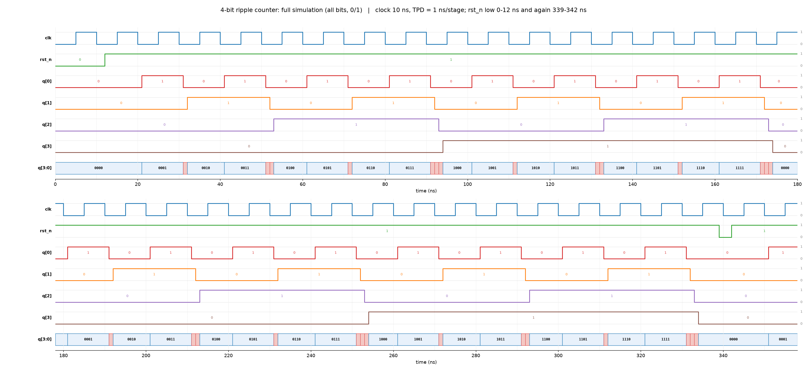
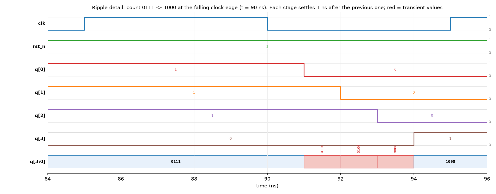
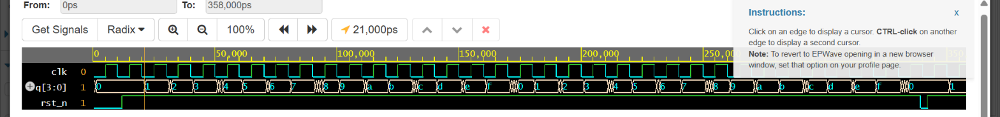

# 4-Bit Ripple Counter (Verilog)

Asynchronous 4-bit up counter built from four negative-edge T flip-flops. Each stage is clocked by the previous stage's output, so the count ripples from `q[0]` to `q[3]`.

**Live simulation (EDA Playground, Icarus Verilog 12.0):** https://www.edaplayground.com/x/DR8z

```
clk -> FF0 -q0-> FF1 -q1-> FF2 -q2-> FF3 -q3
        T=1        T=1        T=1        T=1      (all share active-low async rst_n)
```

## Result
Simulated on EDA Playground: `PASS: all checks passed`. The count runs 0 to 15 twice with wrap, and the async reset clears the count mid-run.

### Full waveform, every bit as 0/1
Clock 10 ns, 1 ns clock-to-Q per stage. `rst_n` is low 0-12 ns and again 339-342 ns. Pink blocks on `q[3:0]` are the transient values while the ripple settles.



### Ripple detail: 0111 -> 1000
At the falling clock edge (90 ns) the change ripples through the stages 1 ns apart: `0111 -> 0110 -> 0100 -> 0000 -> 1000`.



### EPWave screenshot from the actual run


The two graphs above are generated by [`gen_waveform.py`](gen_waveform.py), which models the same stimulus and delays as the testbench. They match the simulator log at every sampled count (32 of 32).

## Files
| File | Purpose |
|---|---|
| `t_ff.v` | Negedge T flip-flop, async active-low reset, `TPD` clk-to-Q delay |
| `ripple_counter_4bit.v` | Top module: 4 chained T flip-flops |
| `tb_ripple_counter_4bit.v` | Self-checking testbench |
| `gen_waveform.py` | Generates the timing diagrams |

## Design code

`t_ff.v`
```verilog
`timescale 1ns/1ps
// Negative-edge triggered T flip-flop with active-low async reset.
// T is tied high in the counter, so each stage toggles on every falling clk edge.
module t_ff (
    input  wire clk,
    input  wire rst_n,
    input  wire t,
    output reg  q
);
    parameter TPD = 1; // clk-to-Q delay (sim only) so the ripple is visible in waveforms

    always @(negedge clk or negedge rst_n) begin
        if (!rst_n)
            q <= #TPD 1'b0;
        else if (t)
            q <= #TPD ~q;
    end
endmodule
```

`ripple_counter_4bit.v`
```verilog
`timescale 1ns/1ps
// 4-bit asynchronous (ripple) up counter.
// Each stage is clocked by the output of the previous stage, not by the
// common clock, so the count ripples from Q[0] to Q[3].
module ripple_counter_4bit (
    input  wire       clk,
    input  wire       rst_n,   // active-low asynchronous reset
    output wire [3:0] q
);
    t_ff ff0 (.clk(clk),  .rst_n(rst_n), .t(1'b1), .q(q[0]));
    t_ff ff1 (.clk(q[0]), .rst_n(rst_n), .t(1'b1), .q(q[1]));
    t_ff ff2 (.clk(q[1]), .rst_n(rst_n), .t(1'b1), .q(q[2]));
    t_ff ff3 (.clk(q[2]), .rst_n(rst_n), .t(1'b1), .q(q[3]));
endmodule
```

## Testbench code

`tb_ripple_counter_4bit.v`
```verilog
`timescale 1ns/1ps

module tb_ripple_counter_4bit;
    reg        clk;
    reg        rst_n;
    wire [3:0] q;

    integer errors;
    integer i;
    reg [3:0] expected;

    ripple_counter_4bit dut (.clk(clk), .rst_n(rst_n), .q(q));

    // 100 MHz clock (period 10 ns); the ripple settles in ~4 ns, well inside a cycle
    initial clk = 1'b0;
    always #5 clk = ~clk;

    task check(input [3:0] exp, input [255:0] what);
        begin
            if (q !== exp) begin
                errors = errors + 1;
                $display("FAIL @%0t: %0s: q=%0d expected=%0d", $time, what, q, exp);
            end
        end
    endtask

    initial begin
        $dumpfile("dump.vcd");
        $dumpvars(0, tb_ripple_counter_4bit);

        errors = 0;
        rst_n  = 1'b0;
        #12;
        check(4'd0, "after reset");
        rst_n = 1'b1;

        // Count through 2 full wraps (32 falling edges). Sample just before each
        // next falling edge, after the ripple has settled.
        expected = 4'd0;
        for (i = 0; i < 32; i = i + 1) begin
            @(negedge clk);
            expected = expected + 4'd1;   // wraps 15 -> 0 naturally
            #8;                           // > 4 x TPD
            check(expected, "count");
            $display("t=%0t q=%b (%0d)", $time, q, q);
        end

        // Async reset mid-count: must clear without waiting for a clock edge
        #1 rst_n = 1'b0;
        #3 check(4'd0, "async reset mid-count");
        rst_n = 1'b1;

        // Counts again from 0 after reset release
        @(negedge clk); #8;
        check(4'd1, "first count after reset");

        if (errors == 0) $display("PASS: all checks passed");
        else             $display("FAIL: %0d error(s)", errors);
        $finish;
    end
endmodule
```

## Run online (no install)
1. Open the [playground link](https://www.edaplayground.com/x/DR8z), or open [EDA Playground](https://www.edaplayground.com/) and set Simulator to **Icarus Verilog** with **Open EPWave after run** checked.
2. Paste the testbench in the left pane and `t_ff.v` + `ripple_counter_4bit.v` in the right pane.
3. Run. Expect `PASS: all checks passed`. The waveform is dumped to `dump.vcd` for EPWave.

## Run locally (Icarus Verilog)
```
iverilog -o sim t_ff.v ripple_counter_4bit.v tb_ripple_counter_4bit.v
vvp sim
gtkwave dump.vcd
```

## Notes
- Ripple counters are not fully synchronous: outputs settle stage by stage (about 4 x `TPD`), so the max clock frequency is limited by the total ripple delay and glitch values appear briefly on `q`.
- The testbench samples 8 ns after each falling edge, once the ripple has settled.
